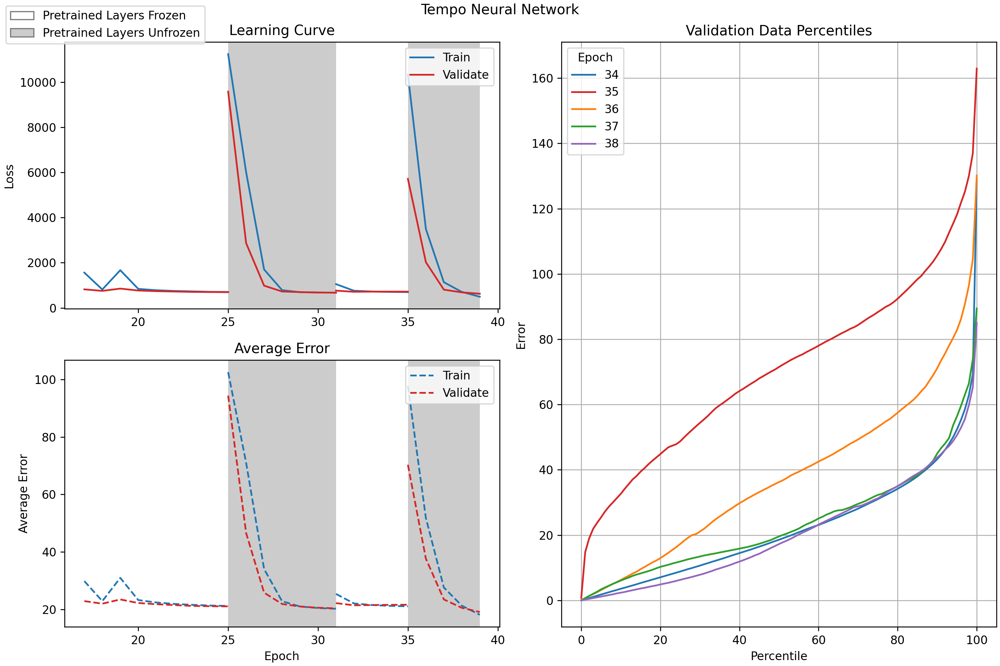
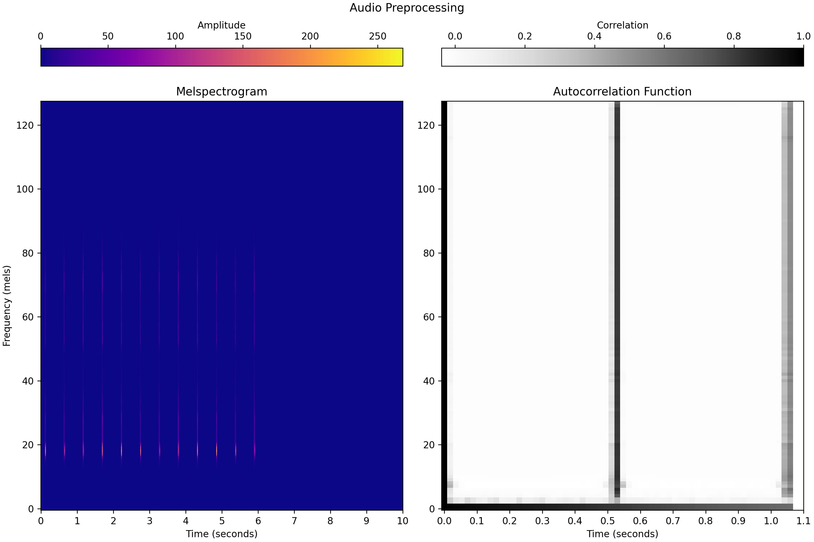
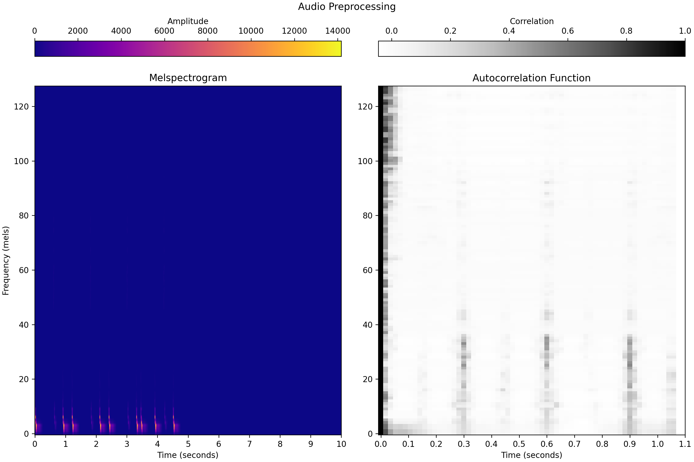
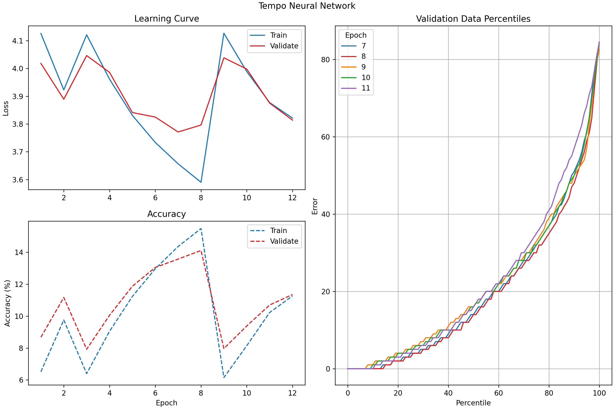
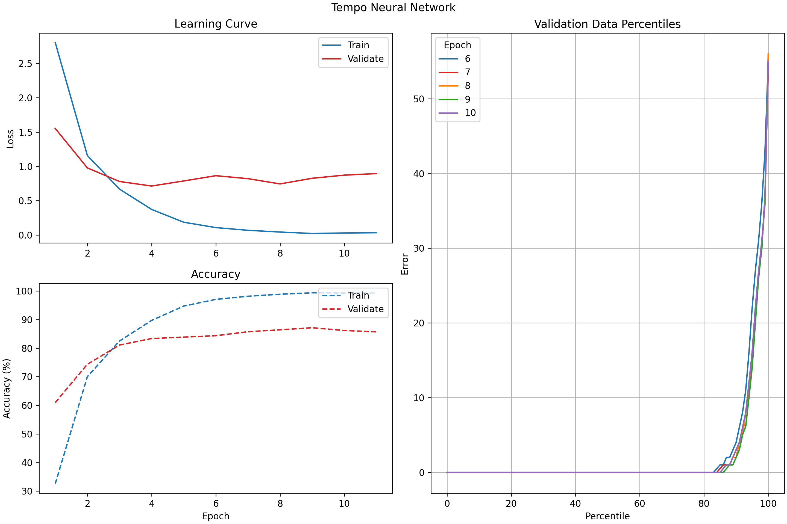
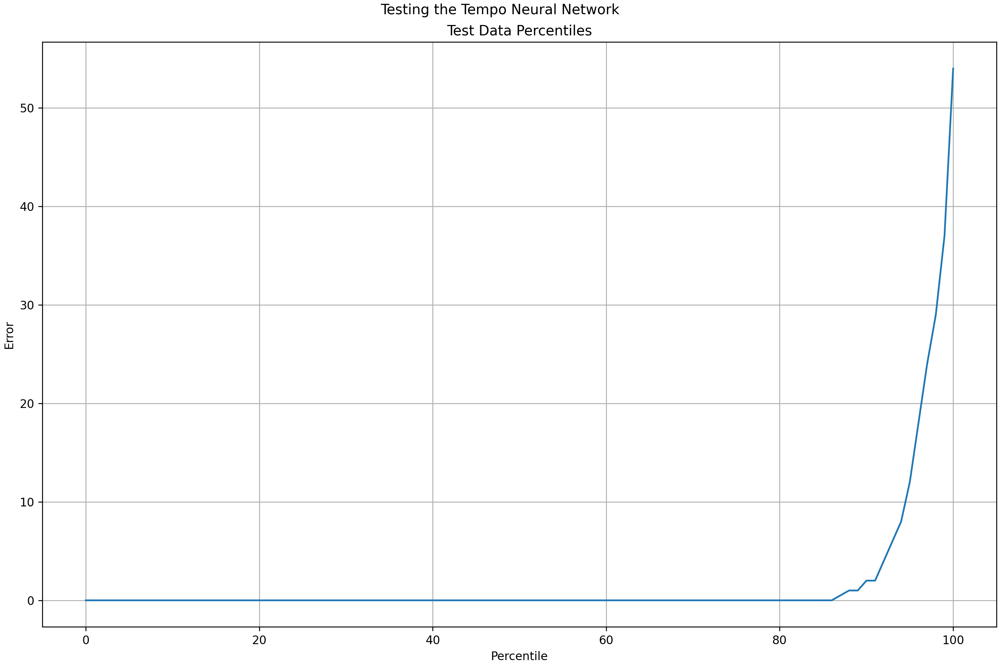

# determine_tempo
Determine the tempo (in BPM) of a given audio sample.

---

## Background

DJs need to know the tempo of a song, typically measured in Beats Per Minute (BPM), if they want to incorporate the track into their mix. For instance, a fast song will not mix well with a slow song, but two fast songs can sound quite good together. I will use machine learning to take an audio file (.mp3) as input and output the song's BPM.


## Data

I will use my personal song library (>2000 songs) to train this neural network, excluding classical and other genres of music that tend to have variable tempos. I will create a data table that contains information on each song's BPM, as well as their key for later use. This will probably involve creating a webscraper that takes an .MP3 as input and uses the MP3's metadata to search a website like [MusicStax](https://https://musicstax.com/) for important song information. I will divide my data 70%-20%-10%: 70% training data, 20% cross validation data, and the remaining 10% for measuring actual performance metrics. I will use 10-second long melspectrogram data for training my neural network -- a couple convolutional layers should be able to pick up on patterns in the mel spectrograms, such as drumbeats or basslines.


## Machine Learning

I will use PyTorch to create a Convolutional Neural Network (CNN) that takes an .MP3 file as input and outputs a single value, the song's tempo measured in BPM. This is a linear regression problem. The hope is that a CNN can better detect patterns in the audio data such as a kick drum or bassline that are useful in maintaining (and thus determining) a song's tempo.

I can use two approaches for this neural network:

- **Window Method**: Because the input of a CNN needs to be of a fixed size, I can train my network on 10-second (or any other amount of time) snippets of audio: *windows*. Using the same window size on which my neural network was trained, I would then scan over a song and for each window output a predicted tempo. The average song would contain about 30 windows (and thus predicted BPM values), so I would ultimately take the median or mode tempo from this list of BPMs for a final value. The benefit of this method is that there is potential for a lot of training data, as the average song can be divided up into, as mentioned previously, 30 samples.
    - An option for speeding up this method is that once the neural network is trained, instead of sliding a fixed-size window over the *entire* 60- to 180-window song, I can randomly select `n` windows (around ~10) from the song, run each of these windows through the neural network, and then take the median/mode BPM of this subset of values.
- **LSTM Method**. The downside to traditional neural networks is that the input is a fixed size; this is not good when dealing with music, since songs vary significantly in length. To deal with inputs of variable size, Recurrent Neural Networks (RNNs) are used. Vanilla RNNs are quite limited on their own, so an architecture called Long Short Term Memory (LSTM) is used as an improvement. An even greater improvement is to utilize Attention, though this could be quite difficult to implement given my level. By using LSTM at the least, my neural network can take an entire song as input without the need for windowing and output a single value, the song's tempo.

Ultimately, I decided on the Window Method, using a 10 second window. A new window begins every 5 seconds.

---

## Software


### *tempo_dataset.py*

Creates a dataset of *.wav* files that are labelled by tempo. Will be used to train a neural network.

```
python ./tempo_dataset.py labels_filepath output_filepath audio_dir
```

- `labels_filepath` is the absolute filepath to the file generated by `data_collection.py` (see the [*artificial_dj* Github Repo](https://github.com/pnlong/artificial_dj)), which contains the absolute filepaths for **.mp3** files labelled by tempo (and key).
- `output_filepath` is the absolute filepath to which a tempo-specific, labelled dataset will be outputted.
- `audio_dir` is the absolute filepath to the directory where preprocessed **.wav** files will be outputted. These audio samples will be used for machine learning.


### *tempo_neural_network.py*

Trains a neural network to determine the tempo (in Beats per Minute) of an inputted audio file.

```
python ./tempo_neural_network.py labels_filepath nn_filepath freeze_pretrained epochs
```

- `labels_filepath` is the absolute filepath to the file generated by `tempo_dataset.py`, which contains the absolute filepaths for **.wav** files labelled by tempo (in BPM).
- `nn_filepath` is the absolute filepath to which the parameters of the trained neural network will be saved. Use the **.pth** file extension.
- `freeze_pretrained` is a boolean value that represents what layers of the network will be trained. If `True`, the pretrained layers of the network will be frozen while the final regression layer is trained. If `False`, all layers of the pretrained network will be unfrozen and trained. Defaults to `True`.
- `epochs` is the number of epochs that will be used to train the neural network. Defaults to 10 epochs.


### *training_plots.py*

Creates plots describing the training process of the tempo neural network. Assumes `tempo_neural_network.py` has been previously run.

```
python ./training_plots.py history_filepath percentiles_history_filepath output_filepath
```

- `history_filepath` is the absolute filepath to the loss and accuracy history **.tsv** file generated by `tempo_neural_network.py`.
- `percentiles_history_filepath` is the absolute filepath to the history of error percentiles **.tsv** file generated by `tempo_neural_network.py`.
- `output_filepath` is the absolute filepath where the final plot will be outputted.


### *tempo_inferences.py*

Tests the accuracy of the neural network trained in `tempo_neural_network.py`.

```
python ./tempo_inference.py labels_filepath nn_filepath
```

The arguments are the same as for `tempo_neural_network.py`. See above.


---

### *train.sh*

Trains the tempo neural network on a cluster. Assumes `tempo_dataset.py` has already been run.

```
sbatch ./train.sh -e <epochs> -f <freeze_pretrained>
```

- `-e` is the number of epochs to train.
- `-f` is a boolean value representing which layers of the neural network will be frozen in training. See the description of `tempo_neural_network.py` for more information on this argument.


### *test.sh*

Runs `tempo_inferences.py` on a cluster.

```
sbatch ./test.sh
```

### *gunzip_tempo_data.sh*

"Ungzips" and "untars" the directory created by `tempo_dataset.py` on the cluster.

```
sbatch ./gunzip_tempo_data.sh
```

---

### *determine_tempo.py*

Given a song (**.mp3**), output its predicted tempo (in BPM).

```
python ./determine_tempo.py nn_filepath song_filepath
```

- `nn_filepath` is the absolute filepath to the **.pth** file for the tempo neural network trained in `tempo_neural_network.py`.
- `song_filepath` is the absolute filepath to the song (**.mp3**) whose tempo will be predicted.


---


## Results

See the raw training and testing results in `train.out` and `test.out`.

I first attempted to create my own neural network from scratch. Note that one of my "convolutional blocks" consists of a convolutional layer followed by a ReLU activation function and max-pooling. My network had the following layout:

- convolutional block 1
- convolutional block 2
- convolutional block 3
- convolutional block 4
- flattening layer
- linear layer 1 (100 output features)
- linear layer 2 (10 output features)
- output layer (single-feature output, predicted BPM)

This network performed poorly. On both training and validation sets, predicted tempos had an average error of roughly 18 BPM; this was inadequate for my standards. Because the training and validation sets had similar errors, I could tell that my network was suffering from neither high variance nor bias. Combined with the fact that its learning curve had essentially flattened-out after two out of 10 epochs of training, I diagnosed my original network's problem as poor network architecture.

To clarify, my ultimate goal is to train a network that predicts tempo with an average error of less than 5 BPM, and with 95% of predictions having an error of less than 10 BPM.

My next attempt involved using `torchvision`'s pretrained networks, specifically *ResNet50*. Upon loading *ResNet50*'s default weights, I replaced the final classification block with a single-feature-output regression block. The architecture of my regression block looked like this:

- linear layer 1 (1000 output features)
- linear layer 2 (single-feature output)

My method of training involved freezing all of the pretrained *ResNet50* weights while I trained my regression block, followed up by a fine-tuning of the pretrained weights for the same amount of epochs while I froze my regression block. I repeated this back-and-forth process three times, training six epochs each on the first pass, four each on the second pass, and finally two each on the third pass. To my surprise, this model actually performed slightly worse than my custom one, with an average error on both the training and validation sets of about 20 BPM. It was then that I realized that I had forgot a crucial detail in my final regression block: activation functions! Note that a linear block consists of a linear layer followed by a ReLU activation function. I reworked the architecture of my regression block so that it looked like this:

- linear block 1 (1000-feature output)
- linear block 2 (500-feature output)
- linear block 3 (100-feature output)
- output layer (single-feature output, the tempo in BPM)

Ultimately, however, this didn't change much. I had begun tracking various statistics at this point, and they showed that my model was performing quite poorly (see below).



Per my dad's recommendation, I began to target the quality of my input data rather than my network architecture. I did this by applying an autocorrelation function (ACF) to each Mel in my input melspectrograms, thinking this would better capture the periodic nature of music (the tempo). The plot below probably explains it better, but it shows the melspectrogram of a metronome playing at 120 BPM, and then the ACF on the right; the ACF shows a period of ~0.52 seconds, which when converted back into BPM turns out to 115.4 BPM. My hope was that this image would make it easier for my convolutional neural network to pick up on the tempo.



However, metronomes are as simple as they come, so below is a more complex example of a kick drum pattern at 100 BPM.



At the same time, after a meeting with my lab advisor, he pointed out that deep learning models tend to perform better on classification tasks as opposed to regression ones. Instead of outputting a single value, he suggested I should have my model classify any given song to a "tempo range". I implemented this by changing my output to 86 probabilities that map to "tempo ranges"; each "tempo range" represents an integer tempo in the range (85 BPM, 170 BPM]. For example, if applying an argmax function to my model's 86-feature output yielded an index of 0, then the input song has a predicted tempo in the range [85, 86) BPM; if this process outputted an index of 85, the song has a predicted tempo of [170, 171) BPM. In an ideal world, if my model was able to predict tempos with 100% accuracy, even though there is a loss in quality due to my use of *tempo ranges* as opposed to *exact tempos*, the model would only have a maximum error of 0.5 BPM; in the grand scheme of things, a difference in tempo of 0.5 BPM would go largely unnoticed by the average music listener. My new network architecture remained quite similar to my original modification of *ResNet50*, with the only change being the output layer. Note that I do not end my model with a softmax layer (my outputs are logits, which improves the performance of the Cross Entropy loss function). On another note, my lab advisor also discouraged my back-and-forth process of fine-tuning the pretrained model, and rather, I should either just train the regression block or fine-tune the entire model altogether. I chose to do the former, as the latter sounded computationally expensive. The new architecture of the regression block was this:

- linear block 1 (1000-feature output)
- linear block 2 (500-feature output)
- linear block 3 (100-feature output)
- output layer (86-feature output, each representing a "tempo range")

Unfortunately, these changes did not improve my model all that much. The median error in tempo prediction had shrunk from 20 BPM to 15 BPM, which was a positive improvement, albeit far from my goal.



At this point, I realized that my code had a somewhat major bug: when I would resume training from the most recent epoch, the loss function would reset. I later learned that this was due to an error in loading that optimizer's `state_dict`, but more importantly, somewhere along in my debugging process, I returned to using my custom network architecture instead of *ResNet50*. To my surprise, it performed a lot better! I think this was due to the fact that I was training the whole model as opposed to just the final regression layer (as was the case with *ResNet50*), and I imagine if I trained all of *ResNet50* on my data, I would achieve similar results. However, my new (or one could say old) model architure now looked like this:

- convolutional block 1
- convolutional block 2
- convolutional block 3
- convolutional block 4
- flattening layer
- linear block 1 (1000-feature output)
- linear block 2 (500-feature output)
- linear block 3 (100-feature output)
- output layer (86-feature output, each representing a tempo "range")

I trained this network on 10 epochs. The median error in tempo predictions was now 0 BPM, and 95% of tempo predictions had an error <10 BPM.



I was very happy with this result. I also suspect that a portion of the 5% of tempo predictions with errors >10 BPM stem from mislabelled data. Testing on data not used in training yields the following percentiles plot, which shows that the model performs with similar metrics on data it has never seen.



With this result, I concluded my project of using machine learning to determine the tempo of a song.